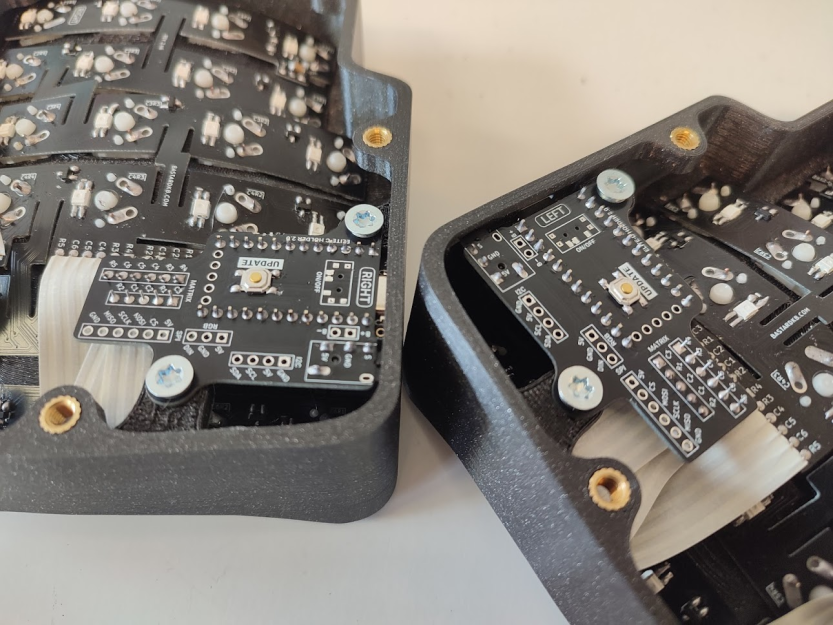

## Holder PCB for the Elite-C

Universal holder PCB for all Bastard Keyboards

## V2

- more visible détrompeur like on the Blackpill shield ( on hidden side once installed/opposite of rst button)
- fancy fonts 
- new edge cuts for top screw, new fancy corners
- matrix headers under elite c
- make the wiring on both sides the same (previously, on charybdis shield is different)
- move rst button
- add pullups on serial for input devices on both sides
- I2c connector
- RAW connector for battery charge when using nice nanos
- on/off switch for nice nanos

## V1.3

- audio jack
- M4 screw holes
- reset button
- rgb holes
- easy matrix pins access

## V1.4

- move bottom screw hole to the left
- add D1 and D0 pins

## How to order

- thickness: 1mm

# License 

This work is licensed under a Creative Commons Attribution-NonCommercial-ShareAlike 4.0 International License.
