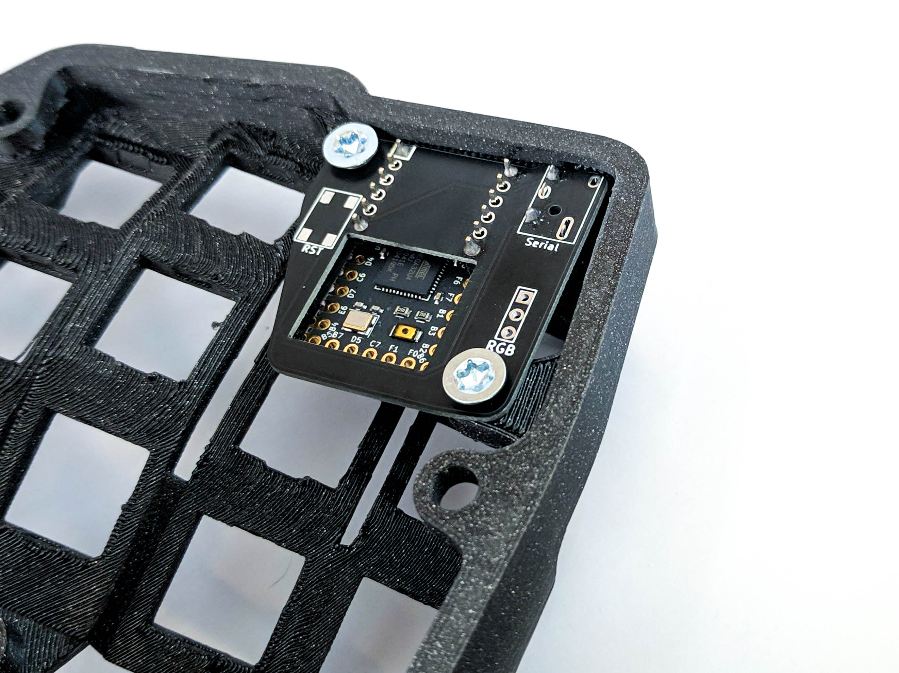

## Holder PCB for the Elite-C

Work in progress - universal one for all Bastard Keyboards

## V1.3

- audio jack
- M4 screw holes
- reset button
- rgb holes
- easy matrix pins access

## V1.4

- move bottom screw hole to the left
- add D1 and D0 pins

## How to order

- thickness: 1mm

# License 

This work is licensed under a Creative Commons Attribution-NonCommercial-ShareAlike 4.0 International License.
